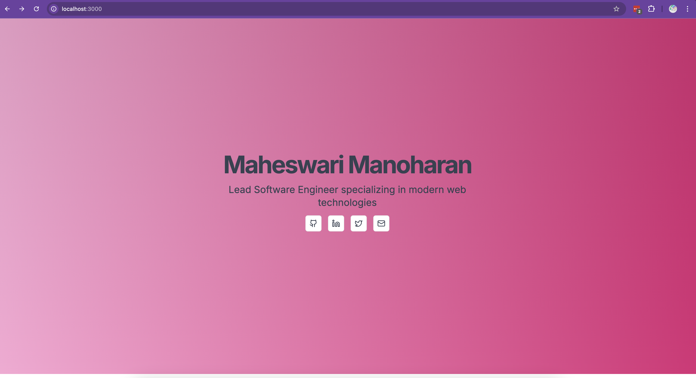
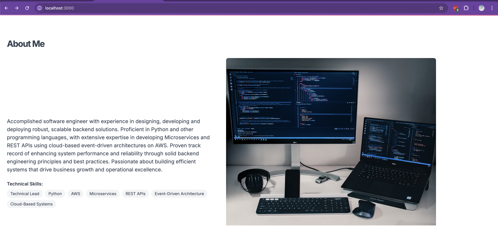

# Maheswari Manoharan - Personal Portfolio developed using Cursor, Bolt and Claude


<!-- Deployment test - 2025-07-20 -->
<!-- Build configuration updated - 2025-07-20 -->

## Prerequisites
- Node.js (version 14 or higher)
- npm or yarn package manager

## Getting Started

1. Clone the repository:
```bash
git clone <repository-url>
cd nextjs-bolt-poc
```

2. Install dependencies:
```bash
npm install
# or
yarn install
```

3. Run the development server:
```bash
npm run dev
# or
yarn dev
```

The application will be available at [http://localhost:3000](http://localhost:3000)

## Available Scripts

- `npm run dev` - Starts the development server
- `npm run build` - Builds the application for production
- `npm run start` - Runs the built application in production mode
- `npm run lint` - Runs ESLint to check for code issues

## Project Structure
- `/app` - Next.js app directory containing pages and layouts
- `/components` - Reusable UI components
- `/hooks` - Custom React hooks
- `/lib` - Utility functions and shared code

## Technologies Used
- Next.js 13.5.1
- React 18.2.0
- TypeScript
- Tailwind CSS
- Radix UI components
- Various other UI and utility libraries

## Deployment

### Azure Static Web Apps Deployment

This project is configured for automated deployment to Azure Static Web Apps using GitHub Actions.

#### Prerequisites
- Azure account
- GitHub repository

#### Quick Setup (Recommended)

Use the automated setup script:

```bash
# Make sure you have Azure CLI installed
brew install azure-cli

# Run the setup script
./scripts/setup-azure.sh
```

The script will:
- ✅ Check Azure CLI installation
- ✅ Guide you through login
- ✅ Create Azure Static Web App
- ✅ Get the deployment token
- ✅ Provide next steps

#### Manual Setup

1. **Create Azure Static Web App**:
   - Go to [Azure Portal](https://portal.azure.com)
   - Search for "Static Web Apps"
   - Click "Create"
   - Fill in the details:
     - **Name**: `your-portfolio-app`
     - **Region**: Choose closest to you
     - **Build Details**:
       - **Build Preset**: Custom
       - **App location**: `/`
       - **Output location**: `.next`

2. **Configure GitHub Secrets**:
   - Go to your GitHub repository
   - Navigate to Settings → Secrets and variables → Actions
   - Add new repository secret:
     - **Name**: `AZURE_STATIC_WEB_APPS_API_TOKEN`
     - **Value**: Copy the deployment token from Azure Static Web App

3. **Deploy**:
   - Push your code to the main branch
   - GitHub Actions will automatically build and deploy
   - Your app will be available at: `https://your-portfolio-app.azurestaticapps.net`

#### Manual Deployment

If you prefer manual deployment:

```bash
# Install Azure CLI
brew install azure-cli

# Login to Azure
az login

# Deploy
npm run build
az staticwebapp create \
  --name your-portfolio-app \
  --resource-group your-resource-group \
  --source . \
  --location "East US" \
  --branch main \
  --app-location "/" \
  --output-location ".next"
```

#### Troubleshooting

**Common Issues:**

1. **"deployment_token was not provided"**
   - Solution: Add the `AZURE_STATIC_WEB_APPS_API_TOKEN` secret to your GitHub repository
   - Go to Settings → Secrets and variables → Actions
   - Add the deployment token from Azure Static Web App

2. **Build fails**
   - Check the build logs in GitHub Actions
   - Ensure all dependencies are in `package.json`
   - Verify Node.js version compatibility

3. **Deployment fails**
   - Check Azure Static Web App logs in Azure Portal
   - Verify the output location is correct (`.next`)
   - Ensure the app location is set to `/`

4. **App not accessible**
   - Check if the Static Web App is running in Azure Portal
   - Verify the URL format: `https://your-app-name.azurestaticapps.net`
   - Check for any custom domain configuration issues

**Getting Help:**
- [Azure Static Web Apps Documentation](https://docs.microsoft.com/en-us/azure/static-web-apps/)
- [GitHub Actions Documentation](https://docs.github.com/en/actions)
- [Next.js Deployment Guide](https://nextjs.org/docs/deployment)

## Screenshots



 
 
